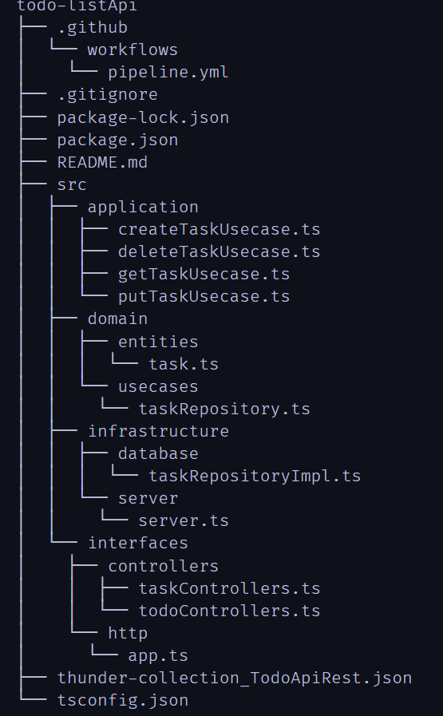

# Todo List API REST

This is a RESTful API developed as part of Sprint 4 at ItAcademy, using Node.js and following the hexagonal architecture.

## Description

The Todo List API is an application that provides endpoints for task management. It allows creating, reading, updating, and deleting tasks (CRUD operations) through HTTP requests.

## Features

- **Create task**: Allows adding a new task.
- **Get tasks**: Retrieve the list of tasks.
- **Update task**: Modify the details of a task.
- **Delete task**: Deletes a task from the list.

## Project Structure

The project is organized according to the hexagonal architecture:

- **src**: Contains the application's source code.
  - **application**: Contains the application's use cases.
  - **domain**: Defines domain entities and use cases.
  - **infrastructure**: Implements the application's infrastructure, such as database access and HTTP server.
  - **interfaces**: Contains controllers and HTTP server configuration.
- **package.json**: npm configuration file with dependencies and scripts for building and running the application.
- **tsconfig.json**: TypeScript compiler configuration.
- **.gitignore**: File specifying files and directories to be ignored by Git.
- **.github/workflows/pipeline.yml**: GitHub Actions configuration for CI/CD pipeline.
- **thunder-collection_TodoApiRest.json**: Thunder Client collection for testing the API.

## Installation

1. Clone this repository: `git clone https://github.com/Aredhel269/todoApiRest.git`
2. Install dependencies: `npm install`
3. Build the application: `npm run build`
4. Start the server: `npm start`

## Testing

The server has been tested using the Visual Studio Code extension, Thunder Client. Tests have been conducted for the following operations:

- **POST**: Create a new task.
- **GET**: Retrieve the list of tasks.
- **PUT**: Modify the details of a task.
- **DELETE**: Delete a task.

## Contribution

If you want to contribute to this project, follow these steps:

1. Fork the repository.
2. Create a new branch: `git checkout -b feature/your-feature-name`
3. Make your changes and commit: `git commit -am 'Add some feature'`
4. Push your changes to the branch: `git push origin feature/your-feature-name`
5. Submit a pull request.

## Support

If you encounter any issues or have any questions, please create a new issue on the [GitHub repository](https://github.com/Aredhel269/todoApiRest/issues).

## License

This project is licensed under the [ISC License](https://opensource.org/licenses/ISC).